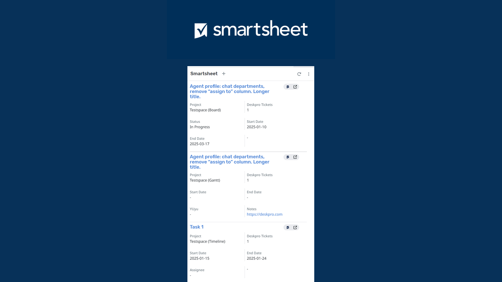

<div align="center">
  <h1>Smartsheet App</h1>
  <a href="https://support.deskpro.com/ga/guides/developers/anatomy-of-an-app" target="_blank">Deskpro Apps Documentation</a>
  <span>&nbsp;&nbsp;•&nbsp;&nbsp;</span>
  <a href="https://smartsheet.redoc.ly/" target="_blank">Smartsheet API Documentation</a>
  <span>&nbsp;&nbsp;•&nbsp;&nbsp;</span>
  <a href="./SETUP.md" target="_blank">Smartsheet App Setup Guide</a>
  <br />
  <hr />
  <br />
</div>



## **About the app**
Smartsheet is a leading work management and collaboration platform, widely used by businesses to streamline project tracking, automate workflows, and enhance team productivity. Known for its spreadsheet-like interface, Smartsheet helps teams plan, execute, and report on work in real time, making it a go-to solution for project managers and organizations seeking greater efficiency.

The Smartsheet integration with Deskpro allowa you to manage your Smartsheet projects & tasks within Deskpro and link your tasks to Deskpro tickets providing a seamless workflow integration.

## **Setting up the app in Deskpro**
You can follow our [setup guide](./SETUP.md) for a step-by-step guide to setting up the Smartsheet app in Deskpro.


## **Development**
This app was developed primarily using Typescript, React, & Vite.
We recommend using [PNPM](https://pnpm.io/) to manage this project.

### **Setup**
To run this project locally:

Clone the repository
 ```bash
 git clone https://github.com/DeskproApps/smartsheet.git
   ```
Change to the project directory:

```bash
cd smartsheet
 ```

Install dependencies
```bash
pnpm install
```

Then, run the development server.

```bash
pnpm start
```

You should now be able to view the app in your browser. For more information about developing Deskpro apps, [Visit the docs](https://support.deskpro.com/ga/guides/developers/anatomy-of-an-app).

### **Testing**
We've included `jest` to run your tests. It will look anywhere in `/src` for test suite files ending in `.test.tsx` or `.test.ts`.

You can run all tests using:

```bash
pnpm test
```

## **Versioning**
Every app deployment requires that the version property in the `manifest.json` file be updated to reflect the new app version. This is so Deskpro can detect changes and add/upgrade apps accordingly. As such, we've made altering versions easy by having CI make the actual version change for you. Here's what we do:

* We increment patch versions, i.e. 1.0.1, automatically. You don't need to do anything and this will happen
* Minor versions, i.e. 1.1.0, are incremented if you add the minor-version GitHub label to your PR
* Major versions, i.e. 2.0.0, are incremented if you add the major-version GitHub label to your PR